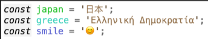

# Individual Primitive Types

## Navigation Links

- [Number](#number)
- [String](#string)
- [Boolean](#boolean)
- [Undefined](#undefined)
- [Null](#null)
- [BigInt](#bigint)
- [Symbol](#symbol)

## Number

The number primitive type is used to express numerical data. It stores this data in
the double-precision 64-bit floating-point format (IEEE 754). 64 bits here refers to there
being 64 binary digits available to store information. The entire 64-bit format that's used in
the IEEE 754 standards can be broken down into three chunks:

- **1 bit for the sign of the number being represented:** Whether the number is
  positive or negative
- **11 bits for the exponent of the number:** This tells us where the radix or decimal
  dot resides
- **52 bits for what's termed the fraction or significand:** This tells us the integer
  value

Technically, there are 53 bits available (not 52) for the expression of an integer value as the
leading bit of the significand field resides within the exponent field.

Having 53 bits available to express an integer value means that any numbers
greater than 253-1 are considered unsafe. These safety limits are available as constants on the
Number object:

- Integers larger than 2^53 or 9007199254740991 (Number.MAX_SAFE_INTEGER)
- Integers smaller than -2^53 or -9007199254740991 (Number.MIN_SAFE_INTEGER)

If we feel ourselves needing an integer outside of these bounds, then we can use JavaScript's BigInt primitive:

```javascript
const max = BigInt(Number.MAX_SAFE_INTEGER);
max + 1n; // => 9007199254740992n (correct)
max + 2n; // => 9007199254740993n (correct)
max + 3n; // => 9007199254740994n (correct)
max + 4n; // => 9007199254740995n (correct)
// ... etc.
```

It's also important to consider the precision of decimal values (such as in fractions) as well. When expressing decimals in JavaScript, you'll
likely encounter issues like this:

```javascript
0.1 + 0.2; // => 0.30000000000000004
```

This is due to inherent mechanism by which fractions are expressed in the floating-point
standard. To get around this problem we can use epsilon. The epsilon is the margin of error inherent to
floating-point math, and JavaScript makes this available to use as Number.EPSILON:

```javascript
Number.EPSILON; // => 0.0000000000000002220446049250313
```

If we wish to compare two numbers, we can simply subtract them from each other and check that the margin is less than the
EPSILON:

```javascript
const someValue = 0.1 + 0.2;
if (Math.abs(someValue - 0.3) < Number.EPSILON) {
  // someValue is (effectively) equal to 0.3
}
```

[Go Back](#navigation-links)

## String

The String type in JavaScript allows us to express sequences of characters. Strings are expressed by delimiting sequences of characters with either single quotes,
double quotes, or backticks:

```javascript
// Single quotes:
const name = "Titanic";
// Double quotes:
const type = "Ship";
// Template literals (back-ticks):
const report = `
RMS Titanic was a British passenger liner that sank
in the North Atlantic Ocean in 1912 after the ship
struck an iceberg during her maiden voyage.
`;
```

We can say that Strings in JavaScript are really just an ordered sequence of 16-bit unsigned integers. Each of these integers is interpreted as a UTF-16 code unit. UTF-16 is a type of encoding for the Unicode character set.

Using it, we are able to express hundreds of thousands of valid Unicode code points. This means that we can express emojis, many languages, and a myriad of Unicode oddities via our strings:



Most code points that we use from day to day only need a single code unit. These are known as
scalars. There are, however, quite a few Unicode code points that require a pair of code
units (known as a surrogate pair). The panda emoji is an example of such a surrogate pair:


Since UTF-16 only has 16 bits to work with, it has to use pairs of 16-bit integers to express
some characters. Naturally, if we're using UTF-32 encoding (with 32 bits to play with), then
we'd be able to express the panda emoji in a single 32-bit integer.

In addition to surrogate pairs, there is another type of combination that's useful to know
about. The Combining Code Point enables certain traditional non-combining code points to be
augmented into new characters.


We've chosen to express this particular combining character via a Unicode escape sequence
(\u0303). The format of \uXXXX allows us to express Unicode code units between U+0000
and U+FFFF within JavaScript strings.

[Go Back](#navigation-links)

## Boolean

The Boolean primitive type in JavaScript is used to represent either true or false. These
polar opposites are its only values:

```javascript
const isTrue = true;
const isFalse = false;
```

Semantically, Booleans are used to represent real-life or problem domain values that can be
considered on or off (0 or 1). We can use such values to dictate control flow within a program:

```javascript
const age = 100;
const hasLivedTo100 = age >= 100;
if (hasLivedTo100) {
  console.log("Congratulations on living to 100!");
}
```

[Go Back](#navigation-links)

## Undefined

The undefined primitive type expresses that something hasn't been defined yet or remains
undefined. Unlike null, undefined may be returned by the language when
something does not have a value:

```javascript
const coffee = {
  type: "Flat White",
  shots: 2,
};
coffee.name; // => undefined
coffee.type; // => "Flat White"
```

It's important to distinguish between the concepts of undefined and not even declared. In
JavaScript, if you try to evaluate an identifier that does not exist within your scope, you will
get a ReferenceError.

However, as you've already seen, if you try to evaluate a property of an object and the
property does not exist, you will get no such error. Instead, it will evaluate to undefined:

```javascript
const obj = {};
obj.foo; // => undefined
```

You can also use JavaScript's void operator on any value that will always return the
real undefined value:

```javascript
void 0; // => undefined
void null; // => undefined
void undefined; // => undefined
```

[Go Back](#navigation-links)

## Null

The null primitive type is used to express the intentional absence of a value. It is a type
with only one value: the only null value is null.

For example, let's consider an API where we specify various properties related to a
restaurant review:

```javascript
setRestaurantFeatures({
  hasWifi: false,
  hasDisabledAccess: true,
  hasParking: null,
});
```

The null value, in this context, means that we do not know the value of hasParking yet.
When we have the necessary information, we can specify hasParking as either true
or false (Boolean), but to express our ignorance of its true value, we're setting it to null.

It is important to check for the exact values we want so that we can avoid bugs and
communicate effectively to the people reading our code. In this case, we may wish to
explicitly check for undefined and null as we want to execute distinct code for that case
versus the case of false. We could accomplish this like so:

```javascript
if (features.hasParking !== null && features.hasParking !== undefined) {
  // hasParking is available...
} else {
  // hasParking is not set (undefined) or unavailable (null)
}
```

[Go Back](#navigation-links)

## BigInt

The BigInt primitive type in JavaScript is used to represent an integer of arbitrary
precision. This means that it can be used to represent integers that are not able to be
precisely represented by JavaScript's Number type.
Literal BigInts are declared by suffixing any sequence of digits with the n character, like so:

```javascript
100007199254740991n;
```

BigInt is capable of representing integers of arbitrary precision, meaning that you can
store integers of unlimited length.

A BigInt can only operate on itself, and is therefore not compatible with many of JavaScript's native Math methods. All native mathematics operators work with BigInt as long as both operands are of the same type

```javascript
1n + 2n * 3n + 4n; // => 11n
```

However, if one operand is a BigInt and the other is a Number, then you'll receive a
TypeError.

[Go Back](#navigation-links)

## Symbol

A Symbol primitive is used to represent an entirely unique value. Symbols are created via
invoking the Symbol function, like so:

```javascript
const totallyUniqueKey = Symbol();
```

Symbols are used to act as property keys where uniqueness is required or where you want
to store metadata on objects. When you add a property to an object with a Symbol key, it
will not be iterated over by normal object iteration approaches (such as for...in). Symbol
keys of an object can only be retrieved via Object.getOwnPropertySymbols:

```javascript
const thing = {};
thing.name = "James";
thing.hobby = "Kayaking";
thing[Symbol(999)] = "Something else entirely";
for (let key in thing) console.log(key);
// => "name"
// => "hobby"
const symbols = Object.getOwnPropertySymbols(thing); // => [Symbol(999)]
thing[symbols[0]]; // => "Something else entirely"
```

[Go Back](#navigation-links)
