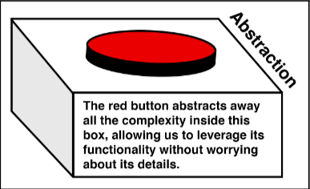

# Meaningful abstractions

As we write code, we use and create abstractions constantly. Abstraction is what occurs
when we take a piece of complexity and then present access to that complexity in a simpler
way.

JavaScript, like many other high-level languages, presents an abstraction that enables us not
to have to worry about the details of how a computer operates. We can, for example, ignore
the problem of memory allocation. Even though we must be sensitive to the constraints of
hardware, especially on mobile devices, we'll rarely ever think about it. The language
doesn't require us to.