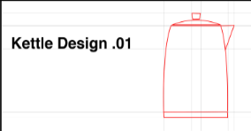
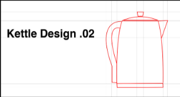

# Truly understanding the problem domain

The first point of failure is typically misunderstanding the problem. If we don't understand
what users are truly trying to accomplish, and we have not received all requirements, then
we will inevitably retain a bad model of the problem

Imagine that this scenario occurs at some point before the invention of the kettle:

- **Susanne (engineer):** Matt, we've been asked to design a vessel that users can boil
  water with
- **Matthew (engineer):** Understood; I will create a vessel that does exactly that

Matthew asks no questions and immediately gets to work, excited at the prospect of putting
his creativity to use. One day later he comes up with the following contraption:

We can see, quite obviously, that Matthew has forgotten one key component. In his haste,
he did not stop to ask Susanne for more information about the user, or about their problem,
and so did not consider the eventuality that a user would need to pick up the boiling-hot
vessel somehow. After receiving feedback, naturally, he designed and introduced a handle
to the kettle:

